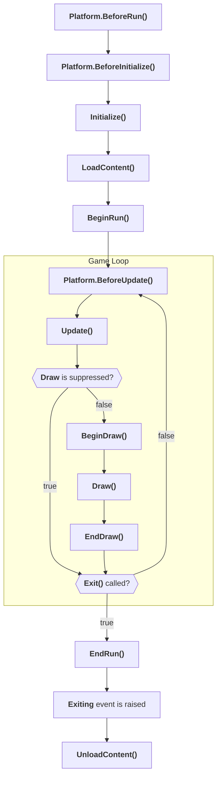

# Notes - Game Loop

## Game Loop

1. `if (Platform.BeforeRun()) BeginRun()`
2. `GraphicsDevice`created
3. `Platform.BeforeInitialize()`
4. `Initialize()`
5. `LoadContent()`
6. `IUpdateable` and `IDrawable` cleared
7. `BeginRun()`
8. *Loop starts*
9. If `IsFixedTimeStep`, wait for `TargetElapsedTime`
10. `Platform.BeforeUpdate()`
11. `Update()`
12. If draw is not suppressed, go to 12, else go to 8
13. `BeginDraw()`
14. `Draw()`
15. `EndDraw()`
16. *Loop repeats unless `Exit()` has been called*
17. `EndRun()`
18. `Exiting` event is raised
19. `UnloadContent()`

## Diagram

